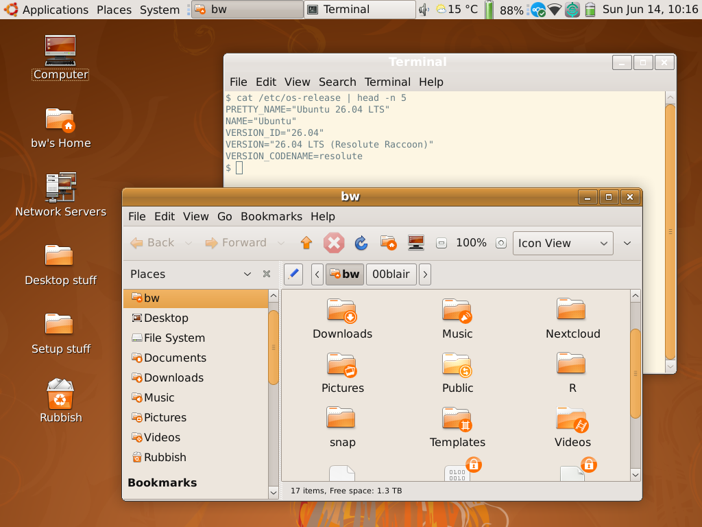
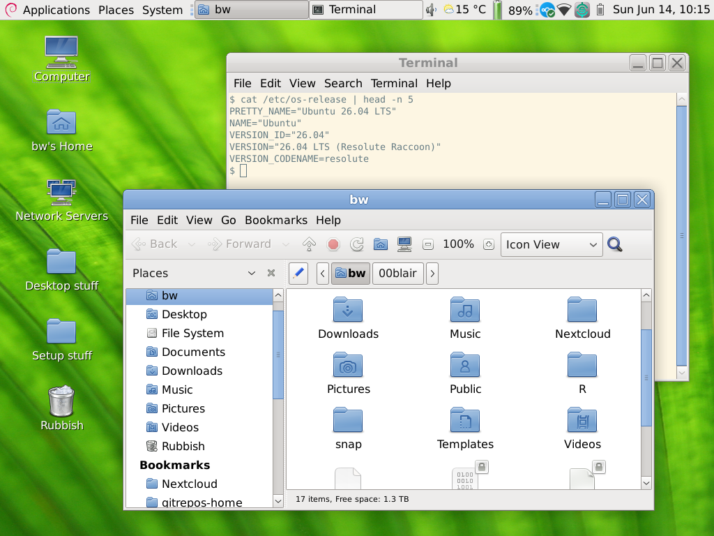

# Setup MATE and Classic Ubuntu theme

## Why?

- **MATE:** Because it's a lot more snappy, especially on older hardware. Actually, even on newer hardware, I was having some issues with gnome-shell using more CPU time than I'd expect it to, and more critically, I was finding that the system would lag for sometimes about 10~15 seconds trying to log in from the lockscreen.

- **Classic Ubuntu:** Nostalgia. But also the warmer colours are a bit easier on the eyes late at night.

- See also: [Bluecurve](https://github.com/neeeeow/Bluecurve) on ["Azure Linux Desktop"](https://www.boxofcables.dev/azure-linux-desktop-a-build-2026-mashup-of-wslc-winui-reactor-and-azure-linux-4-0/) (similar nostalgia, not-as-warm colours)



## Setup MATE

Assuming you are going from a standard Ubuntu 26.04 LTS installation:

```zsh
sudo apt install tasksel
sudo tasksel # select MATE

# On login to MATE
sudo apt install redshift synapse mate-tweak xclip

# If using LibreOffice
sudo apt remove libreoffice-common
```

- Redshift: does the same thing as "night light" on GNOME
- Synpase: configure it to Super+Spacebar and you have a working app search/launcher
- MATE Tweak: to show desktop icons
- xclip: because wl-copy won't be working as MATE doesn't run on Wayland

### Resolving MATE-specific issues

**Cannot start _Ungoogled Chromium_**:

```bash
nano ~/.var/app/io.github.ungoogled_software.ungoogled_chromium/config/chromium-flags.conf
```

Insert the following text:

```bash
--ozone-platform=x11
```

## Classic Ubuntu themes

### Wallpaper

From Ubuntu 8.04 Hardy Heron.

- SVG version: https://wiki.ubuntu.com/Artwork/Incoming/Hardy
- 4K PNG version: https://www.reddit.com/r/Ubuntu/comments/1flts9o/4k_hardy_heron_wallpaper/


### Window controls and window border

I am just using https://www.gnome-look.org/p/1309630 (`TraditionalHumanizedCL` version).

For an alternative, see luigifab's [human-theme](https://github.com/luigifab/human-theme). It's probably a little bit more accurate in some parts; a little bit less earthy and a little bit more 'Frutiger Aero'. The tabs look a bit more accurate compared to [screenshots from the era](http://www.webupd8.org/2009/02/ubuntu-jaunty-jackalope-904-alpha-5.html).

### Classic Human icons

As per vetrixblog's [Reddit post](https://www.reddit.com/r/unixporn/comments/rmxz54/mate_ubuntu_human_nostalgia_on_modern_arch_linux/):

1. Download [human-icon-theme](https://packages.ubuntu.com/jammy/human-icon-theme) and [tangerine-icon-theme](https://packages.ubuntu.com/jammy/tangerine-icon-theme)
2. For both of these, you can right-click to extract, then navigate the usr/share/icons hierarchy in each of the extracted folders. Then you can move **Human** and **Tangerine** both to `~/.icons`.
3. Modify `index.theme` as follows:
    - Before: `Inherits=Tangerine,gnome`
    - After: `Inherits=Tangerine,gnome,Yaru`
    - This will ensure that any missing icons (esp. for more modern apps) are picked up from the Ubuntu 26.04 LTS _Yaru_ theme
4. Delete the following files from `16x16/status` (otherwise the volume-up and volume-down HUD icons will be intensely pixellated):
    - audio-volume-muted.png
    - audio-volume-medium.png
    - audio-volume-low.png
    - audio-volume-high.png

## Alternative version

Based on Clearlooks theme and Mist icons, more 'stock' GNOME, for example as used in Fedora 7 to Fedora 14 (2007-2010).




### Wallpaper

It's the built-in **Blinds.png**, should already be at `/usr/share/backgrounds/mate/nature`

### Window controls and window border

I was having issue with the `mate-themes` package on Ubuntu 26.04 LTS - it would install but some of the theme files weren't being detected by the Appearances settings window.

So, as a workaround:

```
git clone https://github.com/mate-desktop/mate-themes/
```

Then you can copy the relevant folders from `desktop-themes` to `~/.themes`. The one you want is **TraditionalOk**. 

### Classic Mist icons

https://www.gnome-look.org/p/1015867

Modify `index.theme` as follows:
    - Before: `Inherits=gnome`
    - After: `Inherits=gnome,Yaru-blue`
